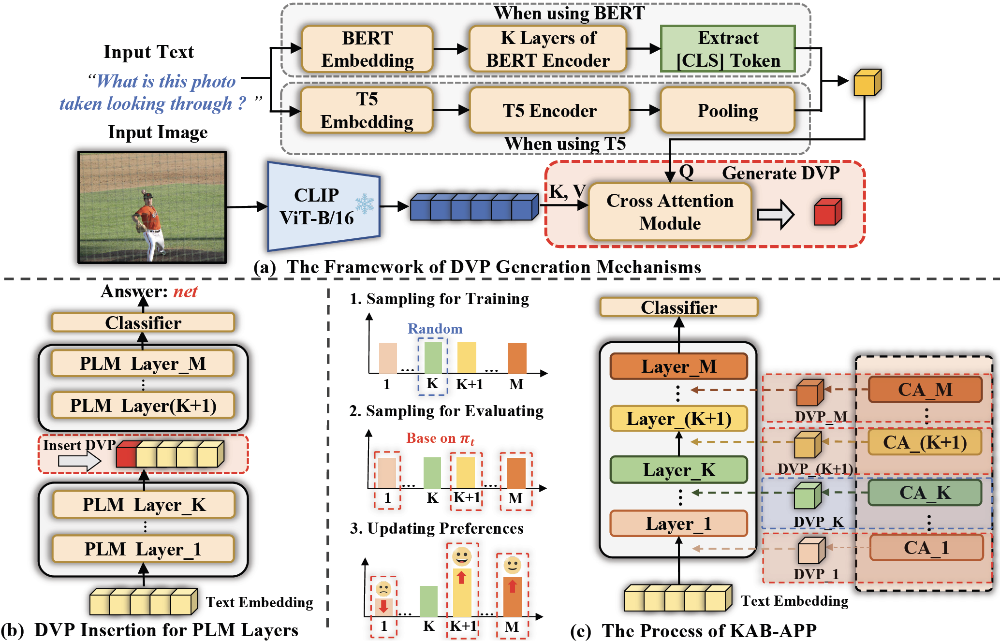

# Dynamic Visual Prompting
[](https://www.python.org/)


This is the official implementation of "Adapting Pre-trained Language Models to Vision-Language Tasks via Dynamic Visual Prompting". In this paper, we propose a novel transfer learning method called **D**ynamic **V**isual **P**rompting (DVP) for efficient PLM adaption, which includes a cross-attention module to obtain compact visual tokens and a k-armed bandit based search algorithm for automatic prompt placement. 


---

## Environment Setup

```bash
pip install torch==1.8.1+cu111 torchvision==0.9.1+cu111 torchaudio==0.8.1 -f https://download.pytorch.org/whl/torch_stable.html
pip install -r requirements.txt
mkdir dataset3s
mkdir result
```

* For LLaMA-7B, you should follow [here](https://huggingface.co/docs/transformers/main/model_doc/llama) to obtain weights and converted to the Hugging Face Transformers format.

* The project structure should look like the following:

```
| -- Dynamic_Visual_prompting
     | -- llama_7b_weights_hf
        | -- config.json 
        | -- generation_config.json
        | -- pytorch_model-00001-of-00002.bin
        | -- pytorch_model-00002-of-00002.bin
        | -- pytorch_model.bin.index.json
        | -- special_tokens_map.json
        | -- tokenizer.json        
        | -- tokenizer.model  
        | -- tokenizer_config.json
     | -- clip
     | -- dvp
     | -- datasets
     | -- result
     | -- run.py
     | -- ...
```


## Dataset Preparation
See [`DATA.md`](./DATA.md)


## KAB-APP

### BERT-DVP
```bash
# VQA2.0
CUDA_VISIBLE_DEVICES=0 python run.py with data_root=./datasets num_gpus=1 num_nodes=1 dvp_search_bert_vqa per_gpu_batchsize=256

# GQA
CUDA_VISIBLE_DEVICES=0 python run.py with data_root=./datasets num_gpus=1 num_nodes=1 dvp_search_bert_gqa per_gpu_batchsize=256

# SNLI-VE
CUDA_VISIBLE_DEVICES=0 python run.py with data_root=./datasets num_gpus=1 num_nodes=1 dvp_search_bert_snli_ve per_gpu_batchsize=256
```

### T5-DVP
```bash
# VQA2.0
CUDA_VISIBLE_DEVICES=0 python run.py with data_root=./datasets num_gpus=1 num_nodes=1 dvp_search_t5_vqa per_gpu_batchsize=256

# GQA
CUDA_VISIBLE_DEVICES=0 python run.py with data_root=./datasets num_gpus=1 num_nodes=1 dvp_search_t5_gqa per_gpu_batchsize=256

# SNLI-VE
CUDA_VISIBLE_DEVICES=0 python run.py with data_root=./datasets num_gpus=1 num_nodes=1 dvp_search_t5_snli_ve per_gpu_batchsize=256
```

### LLaMA-DVP<sub>*adp*</sub>
```bash
# VQA2.0
CUDA_VISIBLE_DEVICES=0 python run.py with data_root=./datasets num_gpus=1 num_nodes=1 dvp_search_llama_vqa per_gpu_batchsize=128

# GQA
CUDA_VISIBLE_DEVICES=0 python run.py with data_root=./datasets num_gpus=1 num_nodes=1 dvp_search_llama_gqa per_gpu_batchsize=128

# SNLI-VE
CUDA_VISIBLE_DEVICES=0 python run.py with data_root=./datasets num_gpus=1 num_nodes=1 dvp_search_llama_snli_ve per_gpu_batchsize=64
```

* <font color='red'>**Note**</font>: For different PLMs or VL tasks, KAB-APP will finally print out the searched DVP placement `K`, and you need to record `K` for subsequent training.

* Since we override `optimizer_step()`, `batch_size` needs to be consistent with `per_gpu_batchsize`.


## Finetuning
### BERT-DVP
```bash
# VQA2.0
CUDA_VISIBLE_DEVICES=0 python run.py with data_root=./datasets num_gpus=1 num_nodes=1 dvp_adaption_bert_vqa per_gpu_batchsize=256 insert_layer=K

# GQA
CUDA_VISIBLE_DEVICES=0 python run.py with data_root=./datasets num_gpus=1 num_nodes=1 dvp_adaption_bert_gqa per_gpu_batchsize=256 insert_layer=K

# SNLI-VE
CUDA_VISIBLE_DEVICES=0 python run.py with data_root=./datasets num_gpus=1 num_nodes=1 dvp_adaption_bert_snli_ve per_gpu_batchsize=256 insert_layer=K
```
### T5-DVP
```bash
# VQA2.0
CUDA_VISIBLE_DEVICES=0 python run.py with data_root=./datasets num_gpus=1 num_nodes=1 dvp_adaption_t5_vqa per_gpu_batchsize=256 insert_layer=K

# GQA
CUDA_VISIBLE_DEVICES=0 python run.py with data_root=./datasets num_gpus=1 num_nodes=1 dvp_adaption_t5_gqa per_gpu_batchsize=256 insert_layer=K

# SNLI-VE
CUDA_VISIBLE_DEVICES=0 python run.py with data_root=./datasets num_gpus=1 num_nodes=1 dvp_adaption_t5_snli_ve per_gpu_batchsize=256 insert_layer=K
```

* Here, we use the searched result `K` of KAB-APP for inserting.


## Parameter-Efficient Transfer Learning
### BERT-DVP<sub>*adp*</sub>
```bash
# VQA2.0
CUDA_VISIBLE_DEVICES=0 python run.py with data_root=./datasets num_gpus=1 num_nodes=1 dvp_adaption_bert_vqa per_gpu_batchsize=256 insert_layer=K use_adapter=True learning_rate=1e-3

# GQA
CUDA_VISIBLE_DEVICES=0 python run.py with data_root=./datasets num_gpus=1 num_nodes=1 dvp_adaption_bert_gqa per_gpu_batchsize=256 insert_layer=K use_adapter=True learning_rate=5e-4

# SNLI-VE
CUDA_VISIBLE_DEVICES=0 python run.py with data_root=./datasets num_gpus=1 num_nodes=1 dvp_adaption_bert_snli_ve per_gpu_batchsize=256 insert_layer=K use_adapter=True learning_rate=5e-4
```

### T5-DVP<sub>*adp*</sub>
```bash
# VQA2.0
CUDA_VISIBLE_DEVICES=0 python run.py with data_root=./datasets num_gpus=1 num_nodes=1 dvp_adaption_t5_vqa per_gpu_batchsize=256 insert_layer=K use_adapter=True learning_rate=3e-4

# GQA
CUDA_VISIBLE_DEVICES=0 python run.py with data_root=./datasets num_gpus=1 num_nodes=1 dvp_adaption_t5_gqa per_gpu_batchsize=256 insert_layer=K use_adapter=True learning_rate=3e-4

# SNLI-VE
CUDA_VISIBLE_DEVICES=0 python run.py with data_root=./datasets num_gpus=1 num_nodes=1 dvp_adaption_t5_snli_ve per_gpu_batchsize=256 insert_layer=K use_adapter=True learning_rate=3e-4
```

### LLaMA-DVP<sub>*adp*</sub>
```bash
# VQA2.0
CUDA_VISIBLE_DEVICES=0,1 python run.py with data_root=./datasets num_gpus=2 num_nodes=1 dvp_adaption_llama_vqa per_gpu_batchsize=128 insert_layer=K

# GQA
CUDA_VISIBLE_DEVICES=0,1 python run.py with data_root=./datasets num_gpus=2 num_nodes=1 dvp_adaption_llama_gqa per_gpu_batchsize=128 insert_layer=K

# SNLI-VE
CUDA_VISIBLE_DEVICES=0,1 python run.py with data_root=./datasets num_gpus=2 num_nodes=1 dvp_adaption_llama_snli_ve per_gpu_batchsize=64 insert_layer=K
```


## Evaluation
### VQA2.0
* Because we use VQA2.0 `test-dev` set as the evaluation metric, we need to execute following scripts: 
```bash
# BERT-DVP
CUDA_VISIBLE_DEVICES=0 python run.py with data_root=./datasets num_gpus=1 num_nodes=1 dvp_adaption_bert_vqa per_gpu_batchsize=256 insert_layer=K test_only=True precision=32 load_path=<checkpoint path>

# BERT-DVP with adapter
CUDA_VISIBLE_DEVICES=0 python run.py with data_root=./datasets num_gpus=1 num_nodes=1 dvp_adaption_bert_vqa per_gpu_batchsize=256 insert_layer=K use_adapter=True test_only=True precision=32 load_path=<checkpoint path>

# T5-DVP
CUDA_VISIBLE_DEVICES=0 python run.py with data_root=./datasets num_gpus=1 num_nodes=1 dvp_adaption_t5_vqa per_gpu_batchsize=256 insert_layer=K test_only=True precision=32 load_path=<checkpoint path>

# T5-DVP with adapter
CUDA_VISIBLE_DEVICES=0 python run.py with data_root=./datasets num_gpus=1 num_nodes=1 dvp_adaption_t5_vqa per_gpu_batchsize=256 insert_layer=K use_adapter=True test_only=True precision=32 load_path=<checkpoint path>

# LLaMA-DVP with adapter
CUDA_VISIBLE_DEVICES=0,1 python run.py with data_root=./datasets num_gpus=2 num_nodes=1 dvp_adaption_bert_vqa per_gpu_batchsize=128 insert_layer=K test_only=True precision=32 load_path=<checkpoint path>
```
* The above script will generate `result/vqa_submit_***.json`, you can upload it to eval.ai (https://eval.ai/web/challenges/challenge-page/830/overview) evaluation server to get test-dev score.

### Others
* For GQA and SNLI-VE, it will save the best metric after every epoches, so we don't need extra evaluation.


## LLaMA-DVP<sub>*adp*</sub> for ScienceQA
* We provide the implementation in `./Dynamic_Visual_Prompting_For_SQA` folder. You can follow [`README.md`](./Dynamic_Visual_Prompting_For_SQA/README.md) to execute.